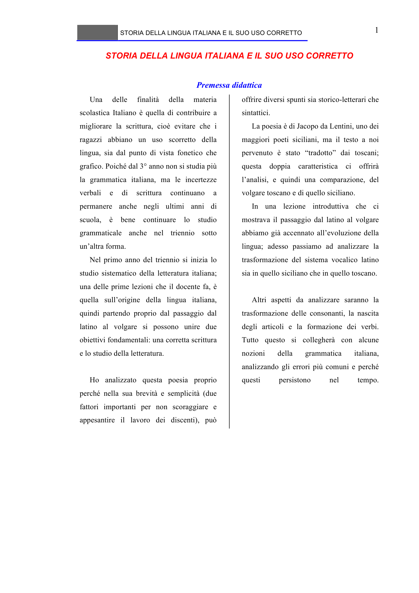

# Micro-lezione 1

## Testo originale

 
STORIA DELLA LINGUA ITALIANA E IL SUO USO CORRETTO 
 
1 
STORIA DELLA LINGUA ITALIANA E IL SUO USO CORRETTO 
 
Premessa didattica 
Una 
delle 
finalità 
della 
materia 
scolastica Italiano è quella di contribuire a 
migliorare la scrittura, cioè evitare che i 
ragazzi abbiano un uso scorretto della 
lingua, sia dal punto di vista fonetico che 
grafico. Poiché dal 3° anno non si studia più 
la grammatica italiana, ma le incertezze 
verbali 
e 
di 
scrittura 
continuano 
a 
permanere anche negli ultimi anni di 
scuola, è bene continuare lo studio 
grammaticale anche nel triennio sotto 
un’altra forma. 
Nel primo anno del triennio si inizia lo 
studio sistematico della letteratura italiana; 
una delle prime lezioni che il docente fa, è 
quella sull’origine della lingua italiana, 
quindi partendo proprio dal passaggio dal 
latino al volgare si possono unire due 
obiettivi fondamentali: una corretta scrittura 
e lo studio della letteratura. 
 
Ho analizzato questa poesia proprio 
perché nella sua brevità e semplicità (due 
fattori importanti per non scoraggiare e 
appesantire il lavoro dei discenti), può 
offrire diversi spunti sia storico-letterari che 
sintattici. 
La poesia è di Jacopo da Lentini, uno dei 
maggiori poeti siciliani, ma il testo a noi 
pervenuto è stato “tradotto” dai toscani; 
questa doppia caratteristica ci offrirà 
l’analisi, e quindi una comparazione, del 
volgare toscano e di quello siciliano. 
In una lezione introduttiva che ci 
mostrava il passaggio dal latino al volgare 
abbiamo già accennato all’evoluzione della 
lingua; adesso passiamo ad analizzare la 
trasformazione del sistema vocalico latino 
sia in quello siciliano che in quello toscano. 
 
Altri aspetti da analizzare saranno la 
trasformazione delle consonanti, la nascita 
degli articoli e la formazione dei verbi. 
Tutto questo si collegherà con alcune 
nozioni 
della 
grammatica 
italiana, 
analizzando gli errori più comuni e perché 
questi 
persistono 
nel 
tempo.
 
 
