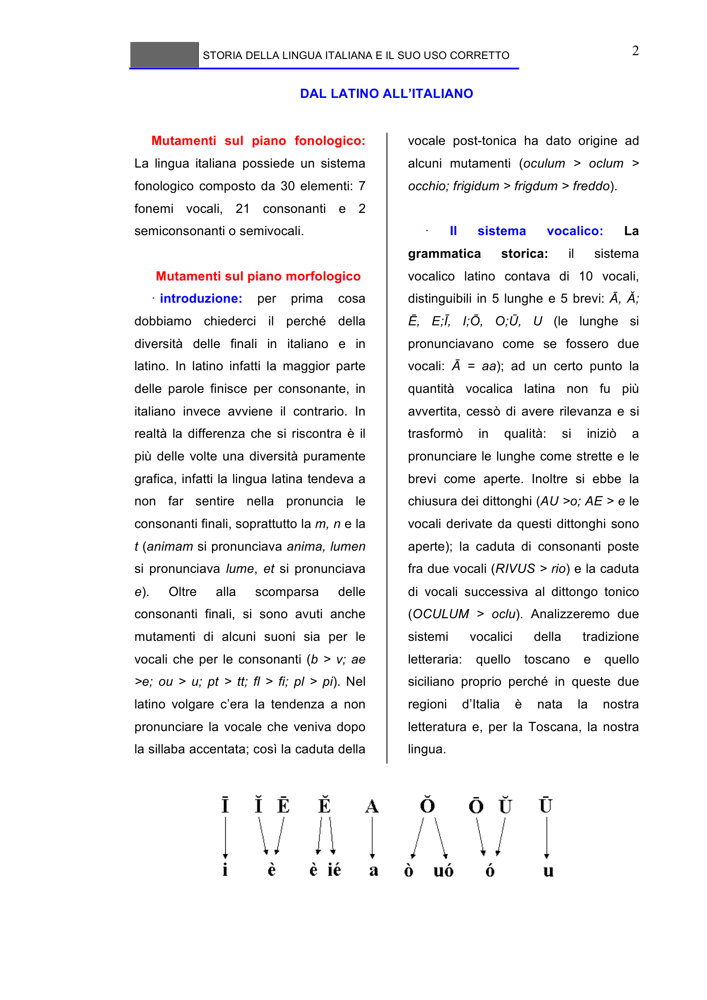

# Micro-lezione 2

## Testo originale

 
STORIA DELLA LINGUA ITALIANA E IL SUO USO CORRETTO 
 
2 
DAL LATINO ALL’ITALIANO 
 
Mutamenti sul piano fonologico: 
La lingua italiana possiede un sistema 
fonologico composto da 30 elementi: 7 
fonemi vocali, 21 consonanti e 2 
semiconsonanti o semivocali. 
 
Mutamenti sul piano morfologico 
· introduzione: 
per 
prima 
cosa 
dobbiamo chiederci il perché della 
diversità delle finali in italiano e in 
latino. In latino infatti la maggior parte 
delle parole finisce per consonante, in 
italiano invece avviene il contrario. In 
realtà la differenza che si riscontra è il 
più delle volte una diversità puramente 
grafica, infatti la lingua latina tendeva a 
non far sentire nella pronuncia le 
consonanti finali, soprattutto la m, n e la 
t (animam si pronunciava anima, lumen 
si pronunciava lume, et si pronunciava 
e). 
Oltre 
alla 
scomparsa 
delle 
consonanti finali, si sono avuti anche 
mutamenti di alcuni suoni sia per le 
vocali che per le consonanti (b > v; ae 
>e; ou > u; pt > tt; fl > fi; pl > pi). Nel 
latino volgare c’era la tendenza a non 
pronunciare la vocale che veniva dopo 
la sillaba accentata; così la caduta della 
vocale post-tonica ha dato origine ad 
alcuni mutamenti (oculum > oclum > 
occhio; frigidum > frigdum > freddo). 
 
· 
Il 
sistema 
vocalico: 
La 
grammatica 
storica: 
il 
sistema 
vocalico latino contava di 10 vocali, 
distinguibili in 5 lunghe e 5 brevi: Ā, Ă; 
Ē, E;Ī, I;Ō, O;Ū, U (le lunghe si 
pronunciavano come se fossero due 
vocali: Ā = aa); ad un certo punto la 
quantità vocalica latina non fu più 
avvertita, cessò di avere rilevanza e si 
trasformò 
in 
qualità: 
si 
iniziò 
a 
pronunciare le lunghe come strette e le 
brevi come aperte. Inoltre si ebbe la 
chiusura dei dittonghi (AU >o; AE > e le 
vocali derivate da questi dittonghi sono 
aperte); la caduta di consonanti poste 
fra due vocali (RIVUS > rio) e la caduta 
di vocali successiva al dittongo tonico 
(OCULUM > oclu). Analizzeremo due 
sistemi 
vocalici 
della 
tradizione 
letteraria: quello toscano e quello 
siciliano proprio perché in queste due 
regioni 
d’Italia 
è 
nata 
la 
nostra 
letteratura e, per la Toscana, la nostra 
lingua.
 
 
