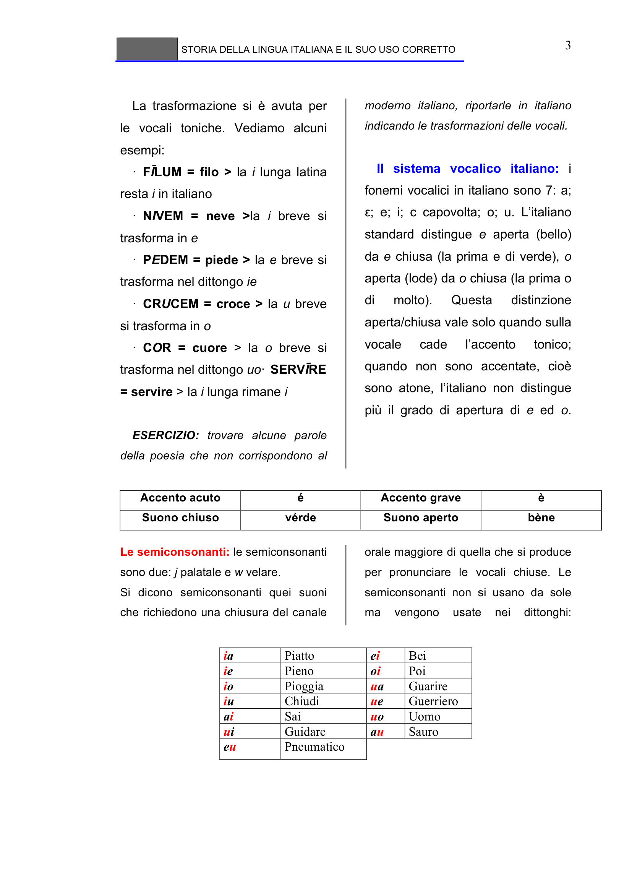

# Micro-lezione 3

## Testo originale

 
STORIA DELLA LINGUA ITALIANA E IL SUO USO CORRETTO 
 
3 
La trasformazione si è avuta per 
le vocali toniche. Vediamo alcuni 
esempi:  
· FĪLUM = filo > la i lunga latina 
resta i in italiano 
· NIVEM = neve >la i breve si 
trasforma in e 
· PEDEM = piede > la e breve si 
trasforma nel dittongo ie 
· CRUCEM = croce > la u breve 
si trasforma in o 
· COR = cuore > la o breve si 
trasforma nel dittongo uo· SERVĪRE 
= servire > la i lunga rimane i 
 
ESERCIZIO: trovare alcune parole 
della poesia che non corrispondono al 
moderno italiano, riportarle in italiano 
indicando le trasformazioni delle vocali. 
 
Il sistema vocalico italiano: i 
fonemi vocalici in italiano sono 7: a; 
ε; e; i; c capovolta; o; u. L’italiano 
standard distingue e aperta (bello) 
da e chiusa (la prima e di verde), o 
aperta (lode) da o chiusa (la prima o 
di 
molto). 
Questa 
distinzione 
aperta/chiusa vale solo quando sulla 
vocale 
cade 
l’accento 
tonico; 
quando non sono accentate, cioè 
sono atone, l’italiano non distingue 
più il grado di apertura di e ed o.
 
Accento acuto 
é 
Accento grave 
è 
Suono chiuso 
vérde 
Suono aperto 
bène 
 
Le semiconsonanti: le semiconsonanti 
sono due: j palatale e w velare. 
Si dicono semiconsonanti quei suoni 
che richiedono una chiusura del canale 
orale maggiore di quella che si produce 
per pronunciare le vocali chiuse. Le 
semiconsonanti non si usano da sole 
ma 
vengono 
usate 
nei 
dittonghi:
 
ia 
Piatto 
ei 
Bei 
ie 
Pieno 
oi 
Poi 
io 
Pioggia 
ua 
Guarire 
iu 
Chiudi 
ue 
Guerriero 
ai 
Sai 
uo 
Uomo 
ui 
Guidare 
au 
Sauro 
eu 
Pneumatico 
 
 
 
