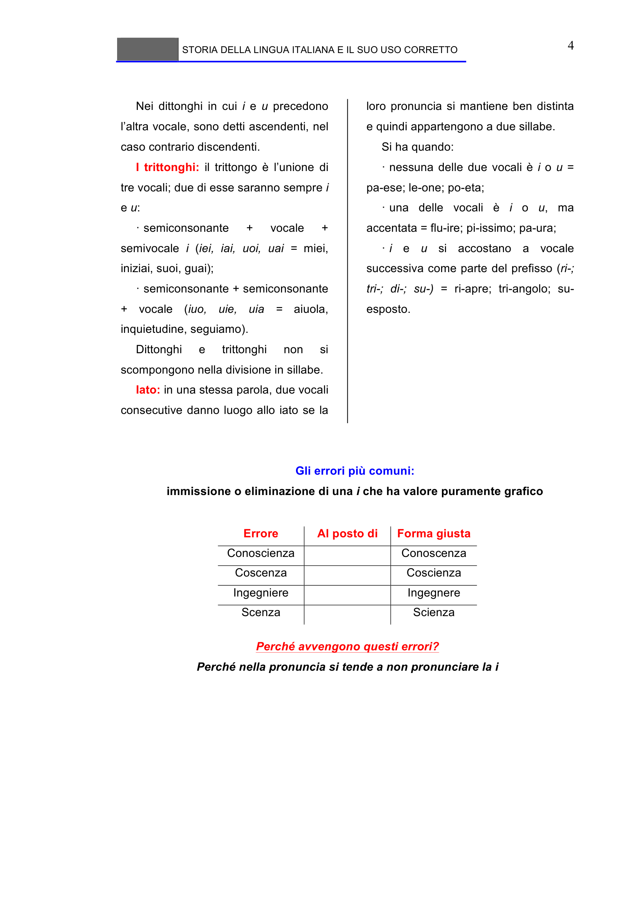

# Micro-lezione 4

## Testo originale

 
STORIA DELLA LINGUA ITALIANA E IL SUO USO CORRETTO 
 
4 
Nei dittonghi in cui i e u precedono 
l’altra vocale, sono detti ascendenti, nel 
caso contrario discendenti. 
I trittonghi: il trittongo è l’unione di 
tre vocali; due di esse saranno sempre i 
e u: 
· semiconsonante 
+ 
vocale 
+ 
semivocale i (iei, iai, uoi, uai = miei, 
iniziai, suoi, guai); 
· semiconsonante + semiconsonante 
+ vocale (iuo, uie, uia = aiuola, 
inquietudine, seguiamo). 
Dittonghi 
e 
trittonghi 
non 
si 
scompongono nella divisione in sillabe.  
Iato: in una stessa parola, due vocali 
consecutive danno luogo allo iato se la 
loro pronuncia si mantiene ben distinta 
e quindi appartengono a due sillabe. 
Si ha quando: 
· nessuna delle due vocali è i o u = 
pa-ese; le-one; po-eta; 
· una delle vocali è i o u, ma 
accentata = flu-ire; pi-issimo; pa-ura; 
· i e u si accostano a vocale 
successiva come parte del prefisso (ri-; 
tri-; di-; su-) = ri-apre; tri-angolo; su-
esposto.
 
 
Gli errori più comuni: 
immissione o eliminazione di una i che ha valore puramente grafico 
 
Errore 
Al posto di 
Forma giusta 
Conoscienza 
Conoscenza 
Coscenza 
Coscienza 
Ingegniere 
Ingegnere 
Scenza 
Scienza 
 
Perché avvengono questi errori? 
Perché nella pronuncia si tende a non pronunciare la i 
 
