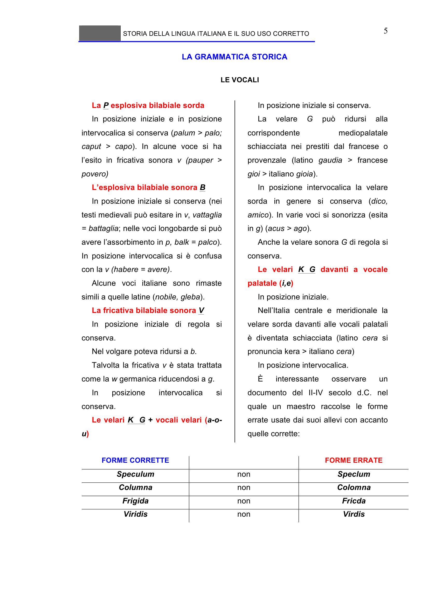

# Micro-lezione 5

## Testo originale

 
STORIA DELLA LINGUA ITALIANA E IL SUO USO CORRETTO 
 
5 
LA GRAMMATICA STORICA 
 
LE VOCALI 
 
La P esplosiva bilabiale sorda 
In posizione iniziale e in posizione 
intervocalica si conserva (palum > palo; 
caput > capo). In alcune voce si ha 
l’esito in fricativa sonora v (pauper > 
povero) 
L’esplosiva bilabiale sonora B 
In posizione iniziale si conserva (nei 
testi medievali può esitare in v, vattaglia 
= battaglia; nelle voci longobarde si può 
avere l’assorbimento in p, balk = palco). 
In posizione intervocalica si è confusa 
con la v (habere = avere). 
Alcune voci italiane sono rimaste 
simili a quelle latine (nobile, gleba).  
La fricativa bilabiale sonora V 
In posizione iniziale di regola si 
conserva. 
Nel volgare poteva ridursi a b. 
Talvolta la fricativa v è stata trattata 
come la w germanica riducendosi a g. 
In 
posizione 
intervocalica 
si 
conserva. 
Le velari K  G + vocali velari (a-o-
u) 
In posizione iniziale si conserva. 
La 
velare 
G 
può 
ridursi 
alla 
corrispondente 
mediopalatale 
schiacciata nei prestiti dal francese o 
provenzale (latino gaudia > francese 
gioi > italiano gioia). 
In posizione intervocalica la velare 
sorda in genere si conserva (dico, 
amico). In varie voci si sonorizza (esita 
in g) (acus > ago). 
Anche la velare sonora G di regola si 
conserva. 
Le velari K G davanti a vocale 
palatale (i,e) 
In posizione iniziale. 
Nell’Italia centrale e meridionale la 
velare sorda davanti alle vocali palatali 
è diventata schiacciata (latino cera si 
pronuncia kera > italiano cera) 
In posizione intervocalica. 
È 
interessante 
osservare 
un 
documento del II-IV secolo d.C. nel 
quale un maestro raccolse le forme 
errate usate dai suoi allevi con accanto 
quelle corrette: 
 
FORME CORRETTE 
 
FORME ERRATE 
Speculum 
non 
Speclum 
Columna 
non 
Colomna 
Frigida 
non 
Fricda 
Viridis 
non 
Virdis 
 
