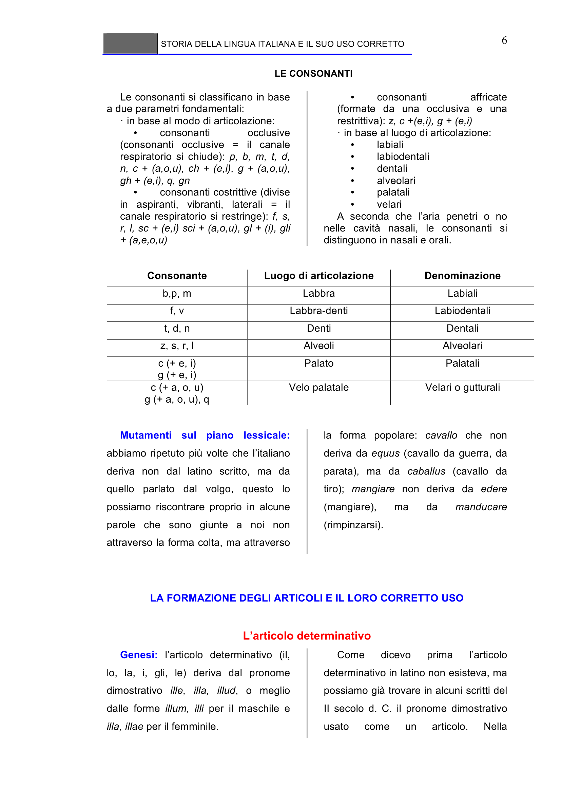

# Micro-lezione 6

## Testo originale

 
STORIA DELLA LINGUA ITALIANA E IL SUO USO CORRETTO 
 
6 
LE CONSONANTI 
 
Le consonanti si classificano in base 
a due parametri fondamentali: 
· in base al modo di articolazione:  
• 
consonanti 
occlusive 
(consonanti occlusive = il canale 
respiratorio si chiude): p, b, m, t, d, 
n, c + (a,o,u), ch + (e,i), g + (a,o,u), 
gh + (e,i), q, gn 
• 
consonanti costrittive (divise 
in aspiranti, vibranti, laterali = il 
canale respiratorio si restringe): f, s, 
r, l, sc + (e,i) sci + (a,o,u), gl + (i), gli 
+ (a,e,o,u) 
• 
consonanti 
affricate 
(formate da una occlusiva e una 
restrittiva): z, c +(e,i), g + (e,i) 
· in base al luogo di articolazione: 
• 
labiali 
• 
labiodentali 
• 
dentali 
• 
alveolari 
• 
palatali 
• 
velari 
A seconda che l’aria penetri o no 
nelle cavità nasali, le consonanti si 
distinguono in nasali e orali. 
 
 
Consonante 
Luogo di articolazione 
Denominazione 
b,p, m 
Labbra 
Labiali 
f, v 
Labbra-denti 
Labiodentali 
t, d, n 
Denti 
Dentali 
z, s, r, l 
Alveoli 
Alveolari 
c (+ e, i) 
g (+ e, i) 
Palato 
Palatali 
c (+ a, o, u) 
g (+ a, o, u), q 
Velo palatale 
Velari o gutturali 
 
 
Mutamenti sul piano lessicale: 
abbiamo ripetuto più volte che l’italiano 
deriva non dal latino scritto, ma da 
quello parlato dal volgo, questo lo 
possiamo riscontrare proprio in alcune 
parole che sono giunte a noi non 
attraverso la forma colta, ma attraverso 
la forma popolare: cavallo che non 
deriva da equus (cavallo da guerra, da 
parata), ma da caballus (cavallo da 
tiro); mangiare non deriva da edere 
(mangiare), 
ma 
da 
manducare 
(rimpinzarsi).
 
 
LA FORMAZIONE DEGLI ARTICOLI E IL LORO CORRETTO USO 
 
L’articolo determinativo 
Genesi: l’articolo determinativo (il, 
lo, la, i, gli, le) deriva dal pronome 
dimostrativo ille, illa, illud, o meglio 
dalle forme illum, illi per il maschile e 
illa, illae per il femminile. 
Come 
dicevo 
prima 
l’articolo 
determinativo in latino non esisteva, ma 
possiamo già trovare in alcuni scritti del 
II secolo d. C. il pronome dimostrativo 
usato 
come 
un 
articolo. 
Nella 
