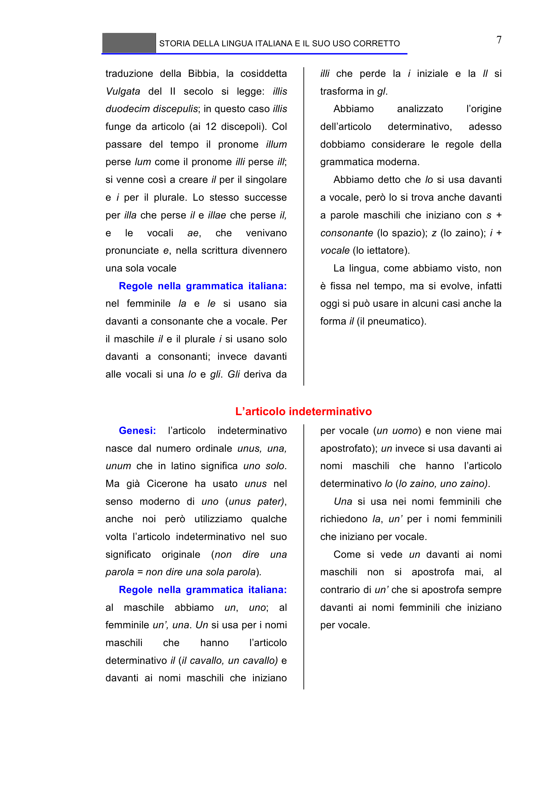

# Micro-lezione 7

## Testo originale

 
STORIA DELLA LINGUA ITALIANA E IL SUO USO CORRETTO 
 
7 
traduzione della Bibbia, la cosiddetta 
Vulgata del II secolo si legge: illis 
duodecim discepulis; in questo caso illis 
funge da articolo (ai 12 discepoli). Col 
passare del tempo il pronome illum 
perse lum come il pronome illi perse ill; 
si venne così a creare il per il singolare 
e i per il plurale. Lo stesso successe 
per illa che perse il e illae che perse il, 
e 
le 
vocali 
ae, 
che 
venivano 
pronunciate e, nella scrittura divennero 
una sola vocale 
Regole nella grammatica italiana: 
nel femminile la e le si usano sia 
davanti a consonante che a vocale. Per 
il maschile il e il plurale i si usano solo 
davanti a consonanti; invece davanti 
alle vocali si una lo e gli. Gli deriva da 
illi che perde la i iniziale e la ll si 
trasforma in gl.  
Abbiamo 
analizzato 
l’origine 
dell’articolo 
determinativo, 
adesso 
dobbiamo considerare le regole della 
grammatica moderna. 
Abbiamo detto che lo si usa davanti 
a vocale, però lo si trova anche davanti 
a parole maschili che iniziano con s + 
consonante (lo spazio); z (lo zaino); i + 
vocale (lo iettatore). 
La lingua, come abbiamo visto, non 
è fissa nel tempo, ma si evolve, infatti 
oggi si può usare in alcuni casi anche la 
forma il (il pneumatico). 
 
L’articolo indeterminativo 
Genesi: 
l’articolo 
indeterminativo 
nasce dal numero ordinale unus, una, 
unum che in latino significa uno solo. 
Ma già Cicerone ha usato unus nel 
senso moderno di uno (unus pater), 
anche noi però utilizziamo qualche 
volta l’articolo indeterminativo nel suo 
significato originale (non dire una 
parola = non dire una sola parola).  
Regole nella grammatica italiana: 
al maschile abbiamo un, uno; al 
femminile un’, una. Un si usa per i nomi 
maschili 
che 
hanno 
l’articolo 
determinativo il (il cavallo, un cavallo) e 
davanti ai nomi maschili che iniziano 
per vocale (un uomo) e non viene mai 
apostrofato); un invece si usa davanti ai 
nomi maschili che hanno l’articolo 
determinativo lo (lo zaino, uno zaino). 
Una si usa nei nomi femminili che 
richiedono la, un’ per i nomi femminili 
che iniziano per vocale.  
Come si vede un davanti ai nomi 
maschili non si apostrofa mai, al 
contrario di un’ che si apostrofa sempre 
davanti ai nomi femminili che iniziano 
per vocale. 
 
 
