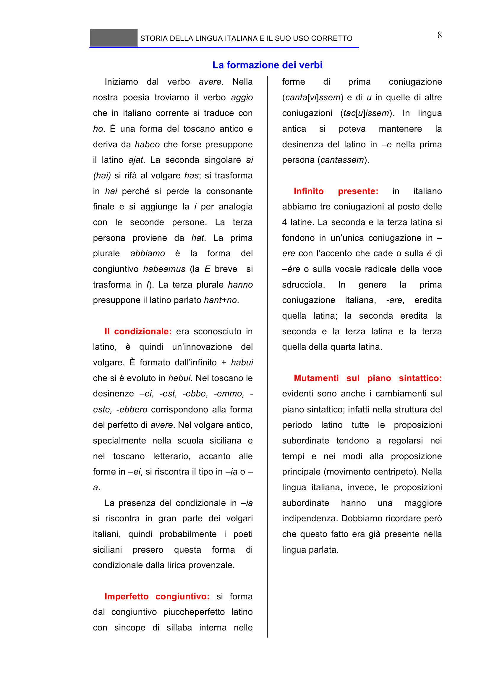

# Micro-lezione 8

## Testo originale

 
STORIA DELLA LINGUA ITALIANA E IL SUO USO CORRETTO 
 
8 
La formazione dei verbi 
Iniziamo dal verbo avere. Nella 
nostra poesia troviamo il verbo aggio 
che in italiano corrente si traduce con 
ho. È una forma del toscano antico e 
deriva da habeo che forse presuppone 
il latino ajat. La seconda singolare ai 
(hai) si rifà al volgare has; si trasforma 
in hai perché si perde la consonante 
finale e si aggiunge la i per analogia 
con le seconde persone. La terza 
persona proviene da hat. La prima 
plurale 
abbiamo 
è 
la 
forma 
del 
congiuntivo habeamus (la E breve  si 
trasforma in I). La terza plurale hanno 
presuppone il latino parlato hant+no.  
 
Il condizionale: era sconosciuto in 
latino, è quindi un’innovazione del 
volgare. È formato dall’infinito + habui 
che si è evoluto in hebui. Nel toscano le 
desinenze –ei, -est, -ebbe, -emmo, -
este, -ebbero corrispondono alla forma 
del perfetto di avere. Nel volgare antico, 
specialmente nella scuola siciliana e 
nel toscano letterario, accanto alle 
forme in –ei, si riscontra il tipo in –ia o –
a.  
La presenza del condizionale in –ia 
si riscontra in gran parte dei volgari 
italiani, quindi probabilmente i poeti 
siciliani 
presero 
questa 
forma 
di 
condizionale dalla lirica provenzale.  
 
Imperfetto congiuntivo: si forma 
dal congiuntivo piuccheperfetto latino 
con sincope di sillaba interna nelle 
forme 
di 
prima 
coniugazione 
(canta[vi]ssem) e di u in quelle di altre 
coniugazioni (tac[u]issem). In lingua 
antica 
si 
poteva 
mantenere 
la 
desinenza del latino in –e nella prima 
persona (cantassem). 
 
Infinito 
presente: 
in 
italiano 
abbiamo tre coniugazioni al posto delle 
4 latine. La seconda e la terza latina si 
fondono in un’unica coniugazione in –
ere con l’accento che cade o sulla é di 
–ére o sulla vocale radicale della voce 
sdrucciola. 
In 
genere 
la 
prima 
coniugazione 
italiana, 
-are, 
eredita 
quella latina; la seconda eredita la 
seconda e la terza latina e la terza 
quella della quarta latina.  
 
Mutamenti sul piano sintattico: 
evidenti sono anche i cambiamenti sul 
piano sintattico; infatti nella struttura del 
periodo latino tutte le proposizioni 
subordinate tendono a regolarsi nei 
tempi e nei modi alla proposizione 
principale (movimento centripeto). Nella 
lingua italiana, invece, le proposizioni 
subordinate 
hanno 
una 
maggiore 
indipendenza. Dobbiamo ricordare però 
che questo fatto era già presente nella 
lingua parlata. 
