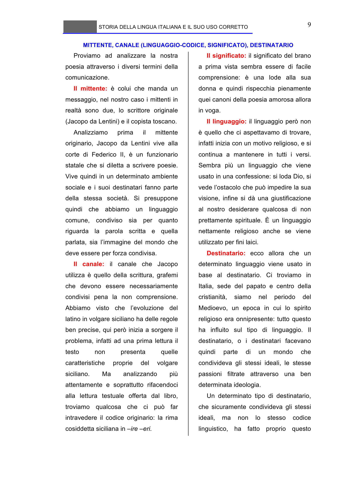

# Micro-lezione 9

## Testo originale

 
STORIA DELLA LINGUA ITALIANA E IL SUO USO CORRETTO 
 
9 
MITTENTE, CANALE (LINGUAGGIO-CODICE, SIGNIFICATO), DESTINATARIO 
Proviamo ad analizzare la nostra 
poesia attraverso i diversi termini della 
comunicazione. 
Il mittente: è colui che manda un 
messaggio, nel nostro caso i mittenti in 
realtà sono due, lo scrittore originale 
(Jacopo da Lentini) e il copista toscano.  
Analizziamo 
prima 
il 
mittente 
originario, Jacopo da Lentini vive alla 
corte di Federico II, è un funzionario 
statale che si diletta a scrivere poesie. 
Vive quindi in un determinato ambiente 
sociale e i suoi destinatari fanno parte 
della stessa società. Si presuppone 
quindi che abbiamo un linguaggio 
comune, condiviso sia per quanto 
riguarda la parola scritta e quella 
parlata, sia l’immagine del mondo che 
deve essere per forza condivisa.  
Il canale: il canale che Jacopo 
utilizza è quello della scrittura, grafemi 
che devono essere necessariamente 
condivisi pena la non comprensione. 
Abbiamo visto che l’evoluzione del 
latino in volgare siciliano ha delle regole 
ben precise, qui però inizia a sorgere il 
problema, infatti ad una prima lettura il 
testo 
non 
presenta 
quelle 
caratteristiche 
proprie 
del 
volgare 
siciliano. 
Ma 
analizzando 
più 
attentamente e soprattutto rifacendoci 
alla lettura testuale offerta dal libro, 
troviamo qualcosa che ci può far 
intravedere il codice originario: la rima 
cosiddetta siciliana in –ire –eri.  
Il significato: il significato del brano 
a prima vista sembra essere di facile 
comprensione: è una lode alla sua 
donna e quindi rispecchia pienamente 
quei canoni della poesia amorosa allora 
in voga.  
Il linguaggio: il linguaggio però non 
è quello che ci aspettavamo di trovare, 
infatti inizia con un motivo religioso, e si 
continua a mantenere in tutti i versi. 
Sembra più un linguaggio che viene 
usato in una confessione: si loda Dio, si 
vede l’ostacolo che può impedire la sua 
visione, infine si dà una giustificazione 
al nostro desiderare qualcosa di non 
prettamente spirituale. È un linguaggio 
nettamente religioso anche se viene 
utilizzato per fini laici.  
Destinatario: ecco allora che un 
determinato linguaggio viene usato in 
base al destinatario. Ci troviamo in 
Italia, sede del papato e centro della 
cristianità, 
siamo 
nel 
periodo 
del 
Medioevo, un epoca in cui lo spirito 
religioso era onnipresente: tutto questo 
ha influito sul tipo di linguaggio. Il 
destinatario, o i destinatari facevano 
quindi 
parte 
di 
un 
mondo 
che 
condivideva gli stessi ideali, le stesse 
passioni filtrate attraverso una ben 
determinata ideologia. 
Un determinato tipo di destinatario, 
che sicuramente condivideva gli stessi 
ideali, 
ma 
non 
lo 
stesso 
codice 
linguistico, ha fatto proprio questo 
