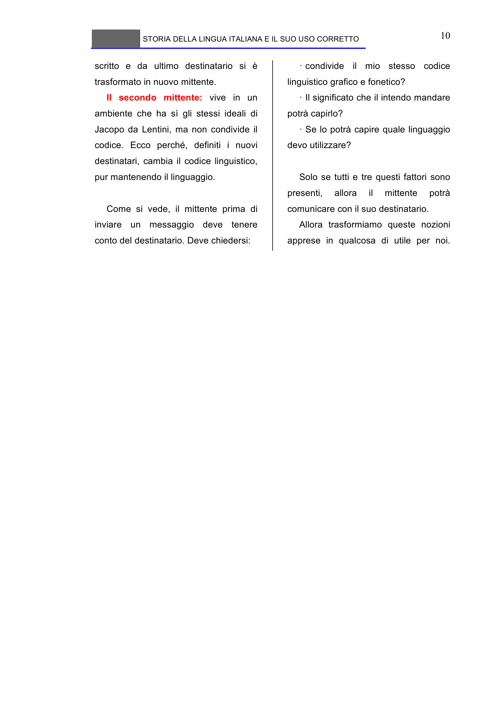

# Micro-lezione 10

## Testo originale

 
STORIA DELLA LINGUA ITALIANA E IL SUO USO CORRETTO 
 
10 
scritto e da ultimo destinatario si è 
trasformato in nuovo mittente. 
Il secondo mittente: vive in un 
ambiente che ha sì gli stessi ideali di 
Jacopo da Lentini, ma non condivide il 
codice. Ecco perché, definiti i nuovi 
destinatari, cambia il codice linguistico, 
pur mantenendo il linguaggio. 
 
Come si vede, il mittente prima di 
inviare un messaggio deve tenere 
conto del destinatario. Deve chiedersi:  
· condivide il mio stesso codice 
linguistico grafico e fonetico? 
· Il significato che il intendo mandare 
potrà capirlo? 
· Se lo potrà capire quale linguaggio 
devo utilizzare? 
 
Solo se tutti e tre questi fattori sono 
presenti, 
allora 
il 
mittente 
potrà 
comunicare con il suo destinatario.  
Allora trasformiamo queste nozioni 
apprese in qualcosa di utile per noi.
 
