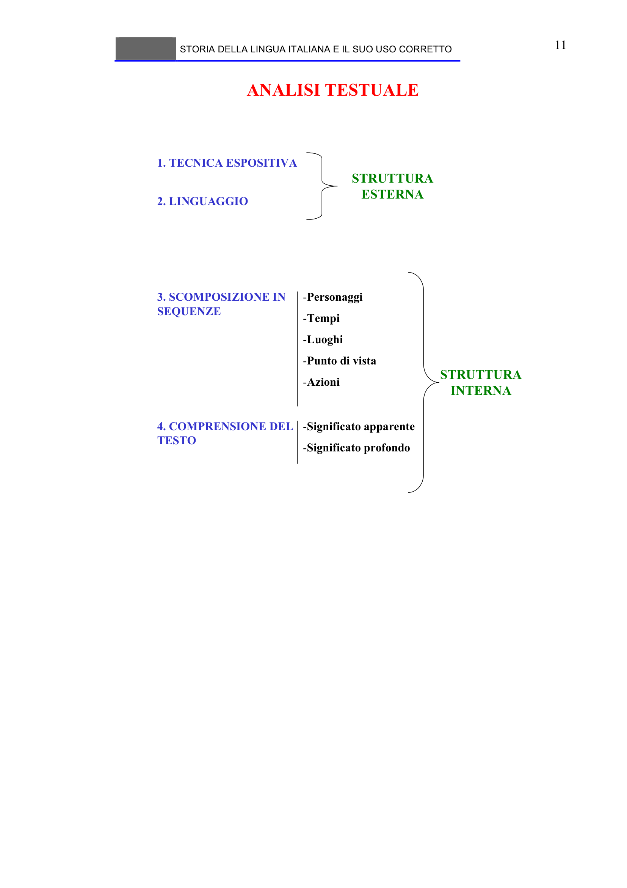

# Micro-lezione 11

## Testo originale

 
STORIA DELLA LINGUA ITALIANA E IL SUO USO CORRETTO 
 
11 
ANALISI TESTUALE
1. TECNICA ESPOSITIVA
2. LINGUAGGIO
STRUTTURA 
ESTERNA
3. SCOMPOSIZIONE IN 
SEQUENZE
-Personaggi
-Tempi 
-Luoghi
-Punto di vista
-Azioni 
4. COMPRENSIONE DEL 
TESTO
-Significato apparente
-Significato profondo
STRUTTURA 
INTERNA
 
