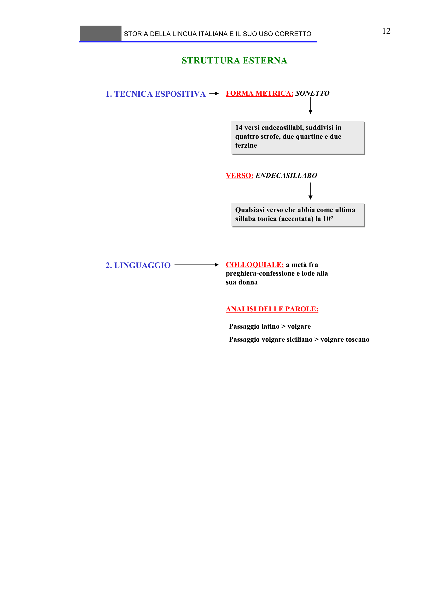

# Micro-lezione 12

## Testo originale

 
STORIA DELLA LINGUA ITALIANA E IL SUO USO CORRETTO 
 
12 
STRUTTURA ESTERNA
1. TECNICA ESPOSITIVA
FORMA METRICA: SONETTO
14 versi endecasillabi, suddivisi in 
quattro strofe, due quartine e due 
terzine
14 versi endecasillabi, suddivisi in 
quattro strofe, due quartine e due 
terzine
VERSO: ENDECASILLABO
Qualsiasi verso che abbia come ultima 
sillaba tonica (accentata) la 10°
Qualsiasi verso che abbia come ultima 
sillaba tonica (accentata) la 10°
2. LINGUAGGIO
COLLOQUIALE: a metà fra 
preghiera-confessione e lode alla 
sua donna
ANALISI DELLE PAROLE:
Passaggio latino > volgare
Passaggio volgare siciliano > volgare toscano
 
