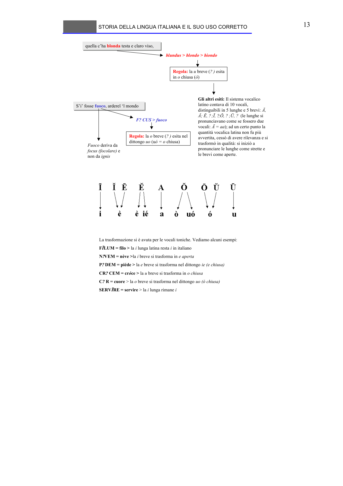

# Micro-lezione 13

## Testo originale

 
STORIA DELLA LINGUA ITALIANA E IL SUO USO CORRETTO 
 
13 
quella c’ha blonda testa e claro viso,
quella c’ha blonda testa e claro viso,
blundus > blondo > biondo
Gli altri esiti: Il sistema vocalico 
latino contava di 10 vocali, 
distinguibili in 5 lunghe e 5 brevi: Ā, 
Ă; Ē, ?;Ī, ?;Ō, ? ;Ū, ? (le lunghe si 
pronunciavano come se fossero due 
vocali: Ā = aa); ad un certo punto la 
quantità vocalica latina non fu più
avvertita, cessò di avere rilevanza e si 
trasformò in qualità: si iniziò a 
pronunciare le lunghe come strette e 
le brevi come aperte. 
Regola: la u breve (? ) esita 
in o chiusa (ó)
La trasformazione si è avuta per le vocali toniche. Vediamo alcuni esempi: 
FĪLUM = filo > la i lunga latina resta i in italiano
N?VEM = nève >la i breve si trasforma in e aperta
P? DEM = piéde > la e breve si trasforma nel dittongo ie (e chiusa)
CR? CEM = cróce > la u breve si trasforma in o chiusa
C? R = cuore > la o breve si trasforma nel dittongo uo (ó chiusa)
SERVĪRE = servire > la i lunga rimane i
S’i’ fosse fuoco, ardereï ‘l mondo
S’i’ fosse fuoco, ardereï ‘l mondo
F? CUS > fuoco
Fuoco deriva da 
focus (focolare) e 
non da ignis
Regola: la o breve (? ) esita nel 
dittongo uo (uó = o chiusa)
 
