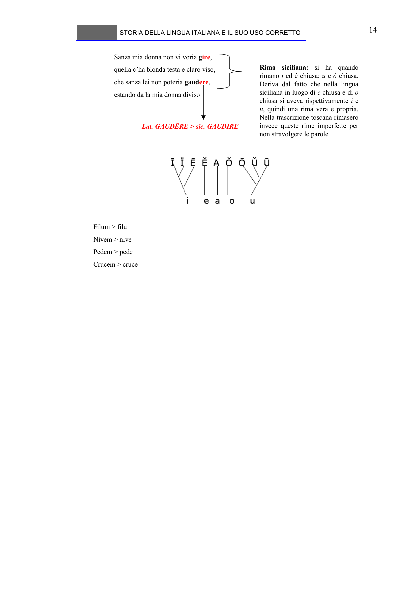

# Micro-lezione 14

## Testo originale

 
STORIA DELLA LINGUA ITALIANA E IL SUO USO CORRETTO 
 
14 
Sanza mia donna non vi voria gire,
quella c’ha blonda testa e claro viso,
che sanza lei non poteria gaudere,
estando da la mia donna diviso
Rima siciliana: si ha quando 
rimano i ed é chiusa; u e ó chiusa. 
Deriva dal fatto che nella lingua 
siciliana in luogo di e chiusa e di o
chiusa si aveva rispettivamente i e 
u, quindi una rima vera e propria. 
Nella trascrizione toscana rimasero 
invece queste rime imperfette per 
non stravolgere le parole
Lat. GAUDĒRE > sic. GAUDIRE
Filum > filu
Nivem > nive
Pedem > pede
Crucem > cruce
 
