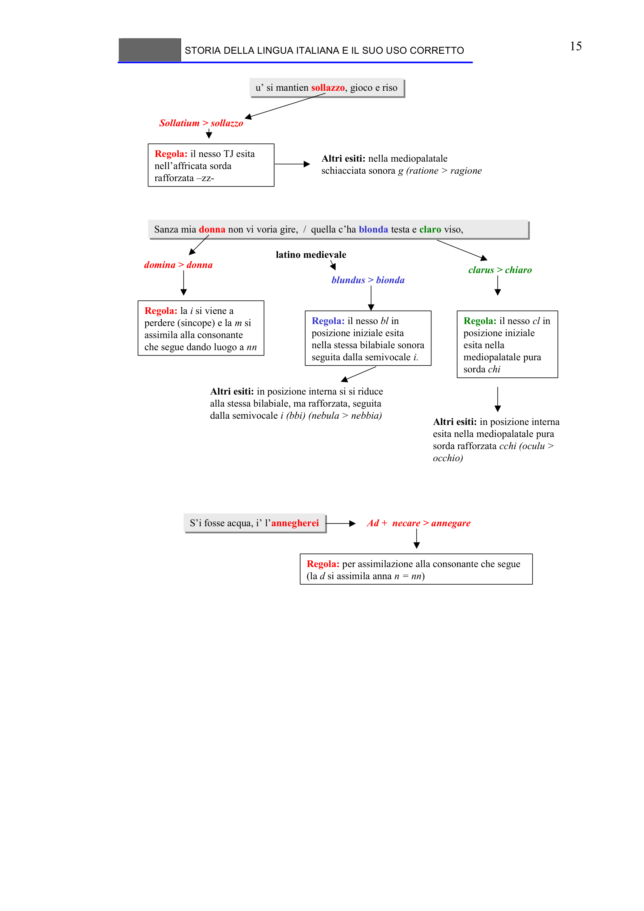

# Micro-lezione 15

## Testo originale

 
STORIA DELLA LINGUA ITALIANA E IL SUO USO CORRETTO 
 
15 
u’ si mantien sollazzo, gioco e riso
u’ si mantien sollazzo, gioco e riso
Sollatium > sollazzo
Regola: il nesso TJ esita 
nell’affricata sorda 
rafforzata –zz-
Altri esiti: nella mediopalatale 
schiacciata sonora g (ratione > ragione
Sanza mia donna non vi voria gire,  /  quella c’ha blonda testa e claro viso,
Sanza mia donna non vi voria gire,  /  quella c’ha blonda testa e claro viso,
blundus > bionda
latino medievale
Regola: il nesso bl in 
posizione iniziale esita 
nella stessa bilabiale sonora 
seguita dalla semivocale i.
Altri esiti: in posizione interna si si riduce 
alla stessa bilabiale, ma rafforzata, seguita 
dalla semivocale i (bbi) (nebula > nebbia)
domina > donna
Regola: la i si viene a 
perdere (sincope) e la m si 
assimila alla consonante 
che segue dando luogo a nn
clarus > chiaro
Regola: il nesso cl in 
posizione iniziale 
esita nella 
mediopalatale pura 
sorda chi
Altri esiti: in posizione interna 
esita nella mediopalatale pura 
sorda rafforzata cchi (oculu > 
occhio)
S’i fosse acqua, i’ l’annegherei
S’i fosse acqua, i’ l’annegherei
Ad + necare > annegare
Regola: per assimilazione alla consonante che segue 
(la d si assimila anna n = nn)
 
