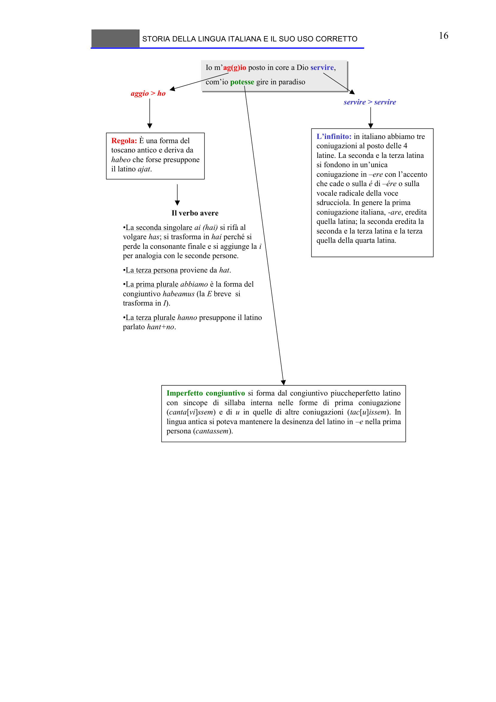

# Micro-lezione 16

## Testo originale

 
STORIA DELLA LINGUA ITALIANA E IL SUO USO CORRETTO 
 
16 
Io m’ag(g)io posto in core a Dio servire, 
com’io potesse gire in paradiso
Io m’ag(g)io posto in core a Dio servire, 
com’io potesse gire in paradiso
aggio > ho
Regola: È una forma del 
toscano antico e deriva da 
habeo che forse presuppone 
il latino ajat.
Il verbo avere 
•La seconda singolare ai (hai) si rifà al 
volgare has; si trasforma in hai perché si 
perde la consonante finale e si aggiunge la i
per analogia con le seconde persone. 
•La terza persona proviene da hat. 
•La prima plurale abbiamo è la forma del 
congiuntivo habeamus (la E breve si 
trasforma in I). 
•La terza plurale hanno presuppone il latino 
parlato hant+no. 
servire > servire
L’infinito: in italiano abbiamo tre 
coniugazioni al posto delle 4 
latine. La seconda e la terza latina 
si fondono in un’unica 
coniugazione in –ere con l’accento 
che cade o sulla é di –ére o sulla 
vocale radicale della voce 
sdrucciola. In genere la prima 
coniugazione italiana, -are, eredita 
quella latina; la seconda eredita la 
seconda e la terza latina e la terza 
quella della quarta latina. 
Imperfetto congiuntivo si forma dal congiuntivo piuccheperfetto latino 
con sincope di sillaba interna nelle forme di prima coniugazione
(canta[vi]ssem) e di u in quelle di altre coniugazioni (tac[u]issem). In 
lingua antica si poteva mantenere la desinenza del latino in –e nella prima 
persona (cantassem).
 
