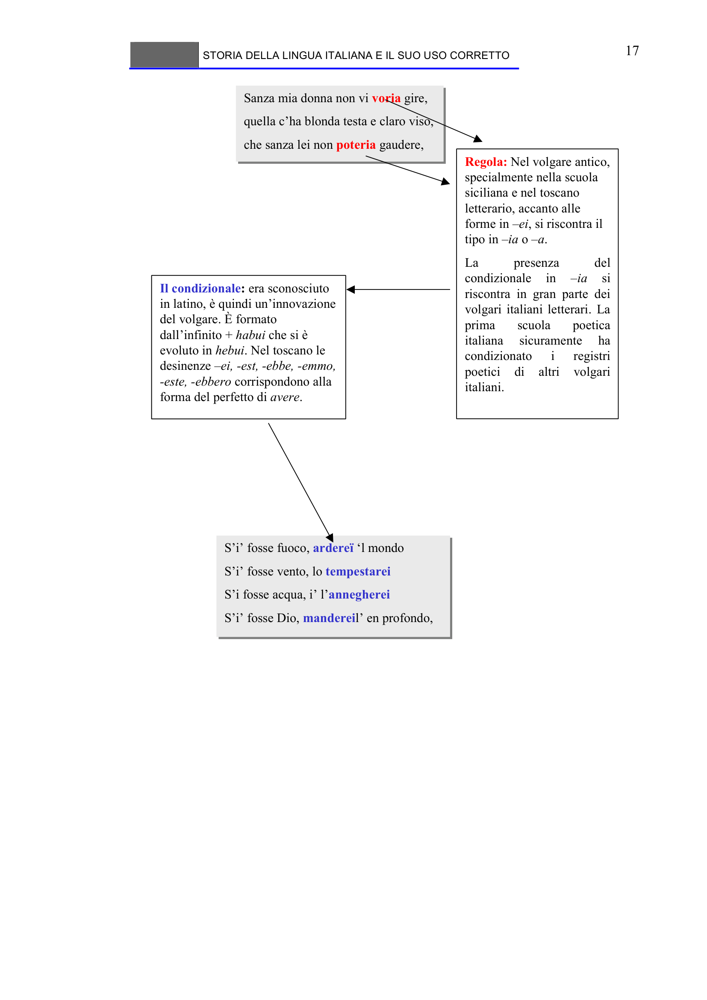

# Micro-lezione 17

## Testo originale

 
STORIA DELLA LINGUA ITALIANA E IL SUO USO CORRETTO 
 
17 
Sanza mia donna non vi voria gire,
quella c’ha blonda testa e claro viso,
che sanza lei non poteria gaudere,
Sanza mia donna non vi voria gire,
quella c’ha blonda testa e claro viso,
che sanza lei non poteria gaudere,
Regola: Nel volgare antico, 
specialmente nella scuola 
siciliana e nel toscano 
letterario, accanto alle 
forme in –ei, si riscontra il 
tipo in –ia o –a. 
La 
presenza 
del 
condizionale 
in 
–ia
si 
riscontra in gran parte dei 
volgari italiani letterari. La 
prima 
scuola 
poetica 
italiana 
sicuramente 
ha 
condizionato 
i 
registri 
poetici 
di 
altri 
volgari 
italiani.
Il condizionale: era sconosciuto 
in latino, è quindi un’innovazione 
del volgare. È formato 
dall’infinito + habui che si è
evoluto in hebui. Nel toscano le 
desinenze –ei, -est, -ebbe, -emmo, 
-este, -ebbero corrispondono alla 
forma del perfetto di avere. 
S’i’ fosse fuoco, ardereï ‘l mondo
S’i’ fosse vento, lo tempestarei
S’i fosse acqua, i’ l’annegherei
S’i’ fosse Dio, mandereil’ en profondo,
S’i’ fosse fuoco, ardereï ‘l mondo
S’i’ fosse vento, lo tempestarei
S’i fosse acqua, i’ l’annegherei
S’i’ fosse Dio, mandereil’ en profondo,
  
 
