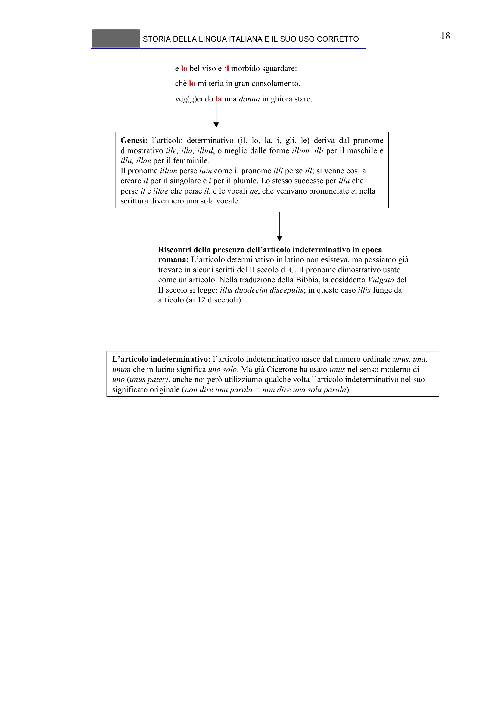

# Micro-lezione 18

## Testo originale

 
STORIA DELLA LINGUA ITALIANA E IL SUO USO CORRETTO 
 
18 
e lo bel viso e ‘l morbido sguardare:
chè lo mi teria in gran consolamento,
veg(g)endo la mia donna in ghiora stare.
Genesi: l’articolo determinativo (il, lo, la, i, gli, le) deriva dal pronome 
dimostrativo ille, illa, illud, o meglio dalle forme illum, illi per il maschile e
illa, illae per il femminile.
Il pronome illum perse lum come il pronome illi perse ill; si venne così a 
creare il per il singolare e i per il plurale. Lo stesso successe per illa che 
perse il e illae che perse il, e le vocali ae, che venivano pronunciate e, nella 
scrittura divennero una sola vocale
Riscontri della presenza dell’articolo indeterminativo in epoca 
romana: L’articolo determinativo in latino non esisteva, ma possiamo già
trovare in alcuni scritti del II secolo d. C. il pronome dimostrativo usato 
come un articolo. Nella traduzione della Bibbia, la cosiddetta Vulgata del 
II secolo si legge: illis duodecim discepulis; in questo caso illis funge da 
articolo (ai 12 discepoli).
L’articolo indeterminativo: l’articolo indeterminativo nasce dal numero ordinale unus, una, 
unum che in latino significa uno solo. Ma già Cicerone ha usato unus nel senso moderno di 
uno (unus pater), anche noi però utilizziamo qualche volta l’articolo indeterminativo nel suo 
significato originale (non dire una parola = non dire una sola parola). 
  
