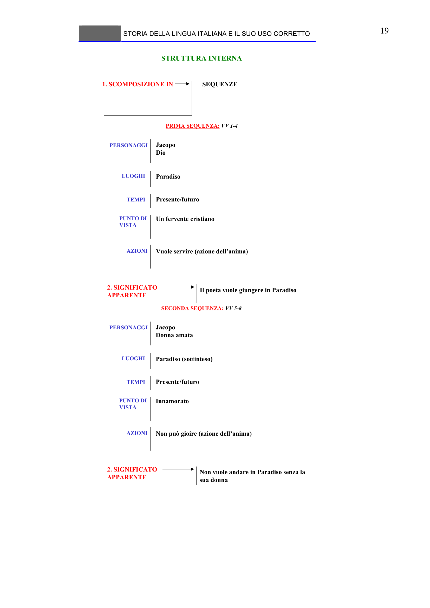

# Micro-lezione 19

## Testo originale

 
STORIA DELLA LINGUA ITALIANA E IL SUO USO CORRETTO 
 
19 
STRUTTURA INTERNA
1. SCOMPOSIZIONE IN
PRIMA SEQUENZA: VV 1-4
SEQUENZE
PERSONAGGI
Jacopo
Dio 
LUOGHI
Paradiso 
TEMPI
Presente/futuro
PUNTO DI 
VISTA
Un fervente cristiano
AZIONI
Vuole servire (azione dell’anima)
Il poeta vuole giungere in Paradiso
2. SIGNIFICATO 
APPARENTE
  
SECONDA SEQUENZA: VV 5-8
PERSONAGGI
Jacopo
Donna amata 
LUOGHI
Paradiso (sottinteso) 
TEMPI
Presente/futuro
PUNTO DI 
VISTA
Innamorato 
AZIONI
Non può gioire (azione dell’anima)
Non vuole andare in Paradiso senza la 
sua donna
2. SIGNIFICATO 
APPARENTE
  
