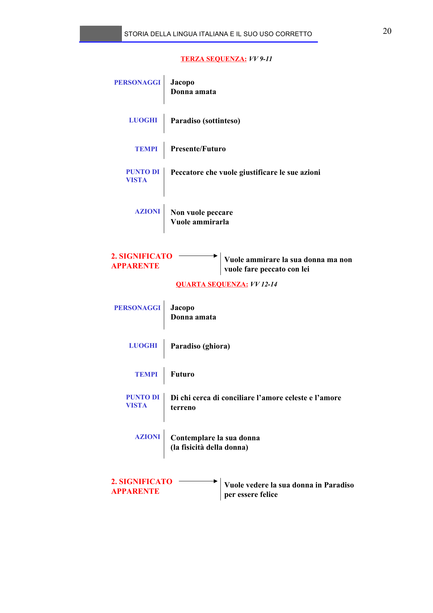

# Micro-lezione 20

## Testo originale

 
STORIA DELLA LINGUA ITALIANA E IL SUO USO CORRETTO 
 
20 
TERZA SEQUENZA: VV 9-11
PERSONAGGI
Jacopo
Donna amata 
LUOGHI
Paradiso (sottinteso) 
TEMPI
Presente/Futuro 
PUNTO DI 
VISTA
Peccatore che vuole giustificare le sue azioni
AZIONI
Non vuole peccare
Vuole ammirarla
Vuole ammirare la sua donna ma non 
vuole fare peccato con lei 
2. SIGNIFICATO 
APPARENTE
  
QUARTA SEQUENZA: VV 12-14
PERSONAGGI
Jacopo
Donna amata 
LUOGHI
Paradiso (ghiora) 
TEMPI
Futuro 
PUNTO DI 
VISTA
Di chi cerca di conciliare l’amore celeste e l’amore 
terreno
AZIONI
Contemplare la sua donna 
(la fisicità della donna)
Vuole vedere la sua donna in Paradiso 
per essere felice 
2. SIGNIFICATO 
APPARENTE
  
