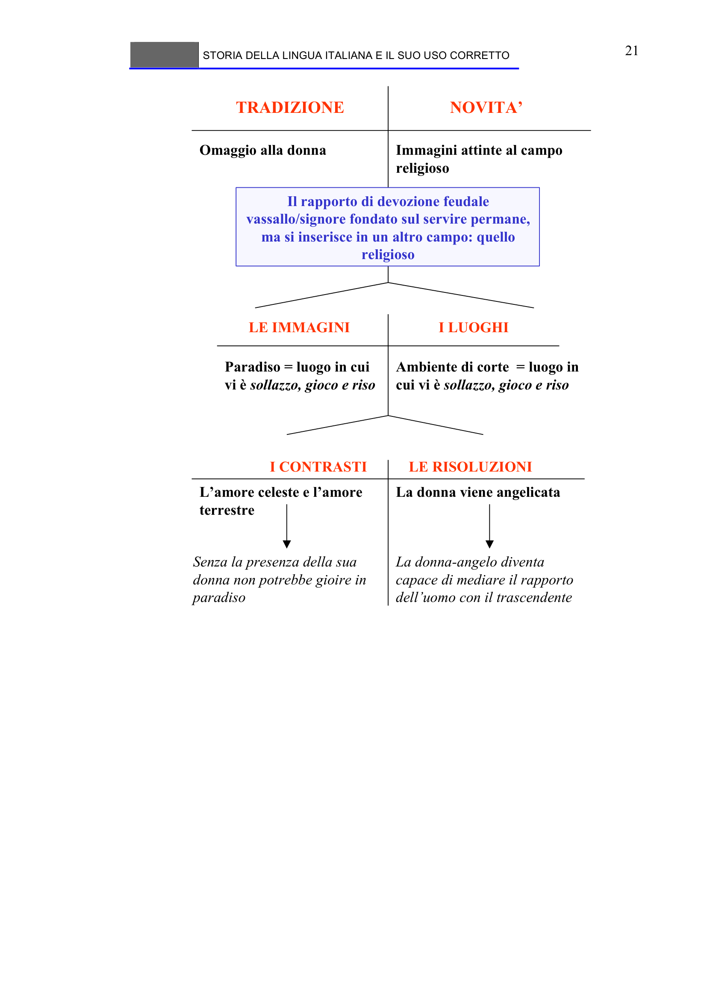

# Micro-lezione 21

## Testo originale

 
STORIA DELLA LINGUA ITALIANA E IL SUO USO CORRETTO 
 
21 
TRADIZIONE
NOVITA’
Omaggio alla donna
Immagini attinte al campo 
religioso
Il rapporto di devozione feudale 
vassallo/signore fondato sul servire permane, 
ma si inserisce in un altro campo: quello 
religioso
LE IMMAGINI
I LUOGHI
Paradiso = luogo in cui 
vi è sollazzo, gioco e riso
Ambiente di corte  = luogo in 
cui vi è sollazzo, gioco e riso
I CONTRASTI
LE RISOLUZIONI
L’amore celeste e l’amore 
terrestre
La donna viene angelicata
Senza la presenza della sua 
donna non potrebbe gioire in 
paradiso
La donna-angelo diventa 
capace di mediare il rapporto 
dell’uomo con il trascendente
  
