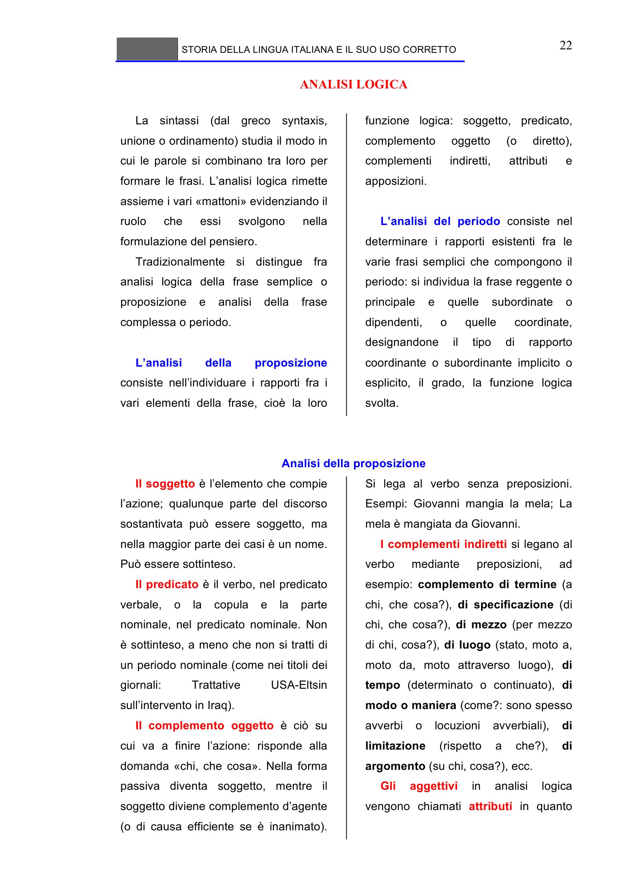

# Micro-lezione 22

## Testo originale

 
STORIA DELLA LINGUA ITALIANA E IL SUO USO CORRETTO 
 
22 
ANALISI LOGICA 
 
La sintassi (dal greco syntaxis, 
unione o ordinamento) studia il modo in 
cui le parole si combinano tra loro per 
formare le frasi. L’analisi logica rimette 
assieme i vari «mattoni» evidenziando il 
ruolo 
che 
essi 
svolgono 
nella 
formulazione del pensiero. 
Tradizionalmente si distingue fra 
analisi logica della frase semplice o 
proposizione 
e 
analisi 
della 
frase 
complessa o periodo. 
 
L’analisi 
della 
proposizione 
consiste nell’individuare i rapporti fra i 
vari elementi della frase, cioè la loro 
funzione logica: soggetto, predicato, 
complemento 
oggetto 
(o 
diretto), 
complementi 
indiretti, 
attributi 
e 
apposizioni. 
 
L’analisi del periodo consiste nel 
determinare i rapporti esistenti fra le 
varie frasi semplici che compongono il 
periodo: si individua la frase reggente o 
principale 
e 
quelle 
subordinate 
o 
dipendenti, 
o 
quelle 
coordinate, 
designandone 
il 
tipo 
di 
rapporto 
coordinante o subordinante implicito o 
esplicito, il grado, la funzione logica 
svolta.
 
 
Analisi della proposizione 
Il soggetto è l’elemento che compie 
l’azione; qualunque parte del discorso 
sostantivata può essere soggetto, ma 
nella maggior parte dei casi è un nome. 
Può essere sottinteso. 
Il predicato è il verbo, nel predicato 
verbale, o la copula e la parte 
nominale, nel predicato nominale. Non 
è sottinteso, a meno che non si tratti di 
un periodo nominale (come nei titoli dei 
giornali: 
Trattative 
USA-Eltsin 
sull’intervento in Iraq). 
Il complemento oggetto è ciò su 
cui va a finire l’azione: risponde alla 
domanda «chi, che cosa». Nella forma 
passiva diventa soggetto, mentre il 
soggetto diviene complemento d’agente 
(o di causa efficiente se è inanimato). 
Si lega al verbo senza preposizioni. 
Esempi: Giovanni mangia la mela; La 
mela è mangiata da Giovanni. 
I complementi indiretti si legano al 
verbo 
mediante 
preposizioni, 
ad 
esempio: complemento di termine (a 
chi, che cosa?), di specificazione (di 
chi, che cosa?), di mezzo (per mezzo 
di chi, cosa?), di luogo (stato, moto a, 
moto da, moto attraverso luogo), di 
tempo (determinato o continuato), di 
modo o maniera (come?: sono spesso 
avverbi 
o 
locuzioni 
avverbiali), 
di 
limitazione 
(rispetto 
a 
che?), 
di 
argomento (su chi, cosa?), ecc. 
Gli 
aggettivi 
in 
analisi 
logica 
vengono chiamati attributi in quanto 
