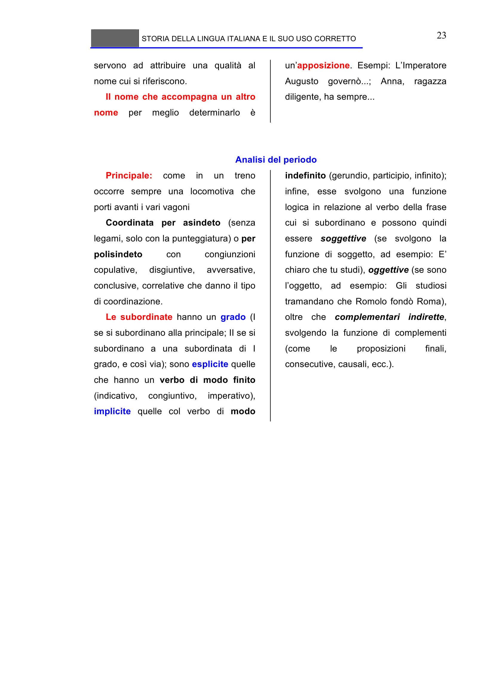

# Micro-lezione 23

## Testo originale

 
STORIA DELLA LINGUA ITALIANA E IL SUO USO CORRETTO 
 
23 
servono ad attribuire una qualità al 
nome cui si riferiscono. 
Il nome che accompagna un altro 
nome 
per 
meglio 
determinarlo 
è 
un’apposizione. Esempi: L’Imperatore 
Augusto governò...; Anna, ragazza 
diligente, ha sempre... 
 
 
Analisi del periodo 
Principale: 
come 
in 
un 
treno 
occorre sempre una locomotiva che 
porti avanti i vari vagoni 
Coordinata per asindeto (senza 
legami, solo con la punteggiatura) o per 
polisindeto 
con 
congiunzioni 
copulative, 
disgiuntive, 
avversative, 
conclusive, correlative che danno il tipo 
di coordinazione. 
Le subordinate hanno un grado (I 
se si subordinano alla principale; II se si 
subordinano a una subordinata di I 
grado, e così via); sono esplicite quelle 
che hanno un verbo di modo finito 
(indicativo, 
congiuntivo, 
imperativo), 
implicite quelle col verbo di modo 
indefinito (gerundio, participio, infinito); 
infine, esse svolgono una funzione 
logica in relazione al verbo della frase 
cui si subordinano e possono quindi 
essere soggettive (se svolgono la 
funzione di soggetto, ad esempio: E’ 
chiaro che tu studi), oggettive (se sono 
l’oggetto, ad esempio: Gli studiosi 
tramandano che Romolo fondò Roma), 
oltre che complementari indirette, 
svolgendo la funzione di complementi 
(come 
le 
proposizioni 
finali, 
consecutive, causali, ecc.). 
 
