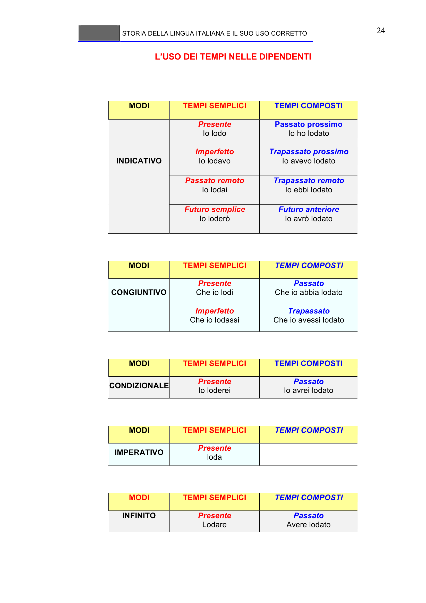

# Micro-lezione 24

## Testo originale

 
STORIA DELLA LINGUA ITALIANA E IL SUO USO CORRETTO 
 
24 
L’USO DEI TEMPI NELLE DIPENDENTI 
 
 
 
 
MODI 
TEMPI SEMPLICI 
TEMPI COMPOSTI 
 
 
 
 
Presente 
Io lodo 
Passato prossimo 
Io ho lodato 
 
INDICATIVO 
Imperfetto 
Io lodavo 
Trapassato prossimo 
Io avevo lodato 
 
Passato remoto 
Io lodai 
Trapassato remoto 
Io ebbi lodato 
 
Futuro semplice 
Io loderò 
Futuro anteriore 
Io avrò lodato 
 
 
MODI 
TEMPI SEMPLICI 
TEMPI COMPOSTI 
 
CONGIUNTIVO 
  
Presente 
Che io lodi 
Passato 
Che io abbia lodato 
 
Imperfetto 
Che io lodassi 
Trapassato 
Che io avessi lodato 
 
 
MODI 
TEMPI SEMPLICI 
TEMPI COMPOSTI 
CONDIZIONALE 
Presente 
Io loderei 
Passato 
Io avrei lodato 
 
 
MODI 
TEMPI SEMPLICI 
TEMPI COMPOSTI 
IMPERATIVO 
Presente 
loda 
 
 
 
MODI 
TEMPI SEMPLICI 
TEMPI COMPOSTI 
INFINITO 
Presente 
Lodare  
Passato 
Avere lodato 
 
 
