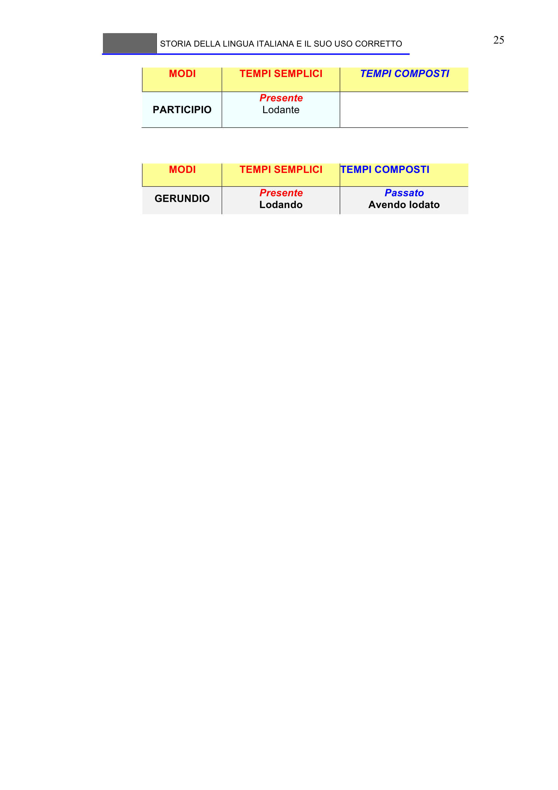

# Micro-lezione 25

## Testo originale

 
STORIA DELLA LINGUA ITALIANA E IL SUO USO CORRETTO 
 
25 
MODI 
TEMPI SEMPLICI 
TEMPI COMPOSTI 
 
 
PARTICIPIO 
Presente 
Lodante  
 
 
 
MODI 
TEMPI SEMPLICI 
TEMPI COMPOSTI 
GERUNDIO 
Presente 
Lodando  
Passato 
Avendo lodato 
 
