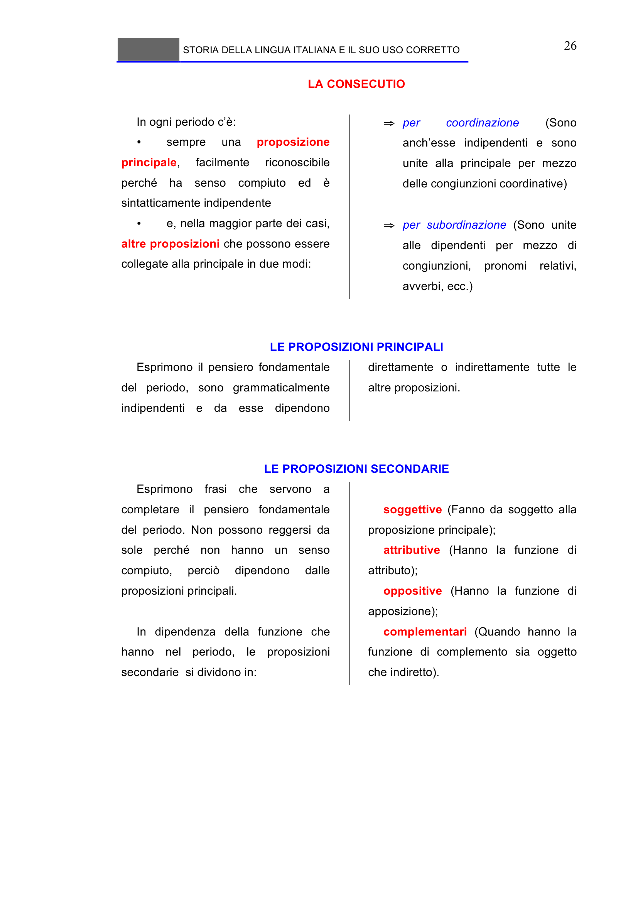

# Micro-lezione 26

## Testo originale

 
STORIA DELLA LINGUA ITALIANA E IL SUO USO CORRETTO 
 
26 
LA CONSECUTIO 
 
In ogni periodo c’è: 
• 
sempre 
una 
proposizione 
principale, 
facilmente 
riconoscibile 
perché ha senso compiuto ed è 
sintatticamente indipendente  
• 
e, nella maggior parte dei casi, 
altre proposizioni che possono essere 
collegate alla principale in due modi: 
 
⇒ per 
coordinazione 
(Sono 
anch’esse indipendenti e sono 
unite alla principale per mezzo 
delle congiunzioni coordinative) 
 
⇒ per subordinazione (Sono unite 
alle dipendenti per mezzo di 
congiunzioni, 
pronomi 
relativi, 
avverbi, ecc.) 
 
 
LE PROPOSIZIONI PRINCIPALI
Esprimono il pensiero fondamentale 
del periodo, sono grammaticalmente 
indipendenti e da esse dipendono 
direttamente o indirettamente tutte le 
altre proposizioni.  
 
 
LE PROPOSIZIONI SECONDARIE 
Esprimono frasi che servono a 
completare il pensiero fondamentale 
del periodo. Non possono reggersi da 
sole perché non hanno un senso 
compiuto, 
perciò 
dipendono 
dalle 
proposizioni principali.  
 
In dipendenza della funzione che 
hanno nel periodo, le proposizioni 
secondarie  si dividono in: 
 
soggettive (Fanno da soggetto alla 
proposizione principale); 
attributive (Hanno la funzione di 
attributo); 
oppositive (Hanno la funzione di 
apposizione); 
complementari (Quando hanno la 
funzione di complemento sia oggetto 
che indiretto). 
 
