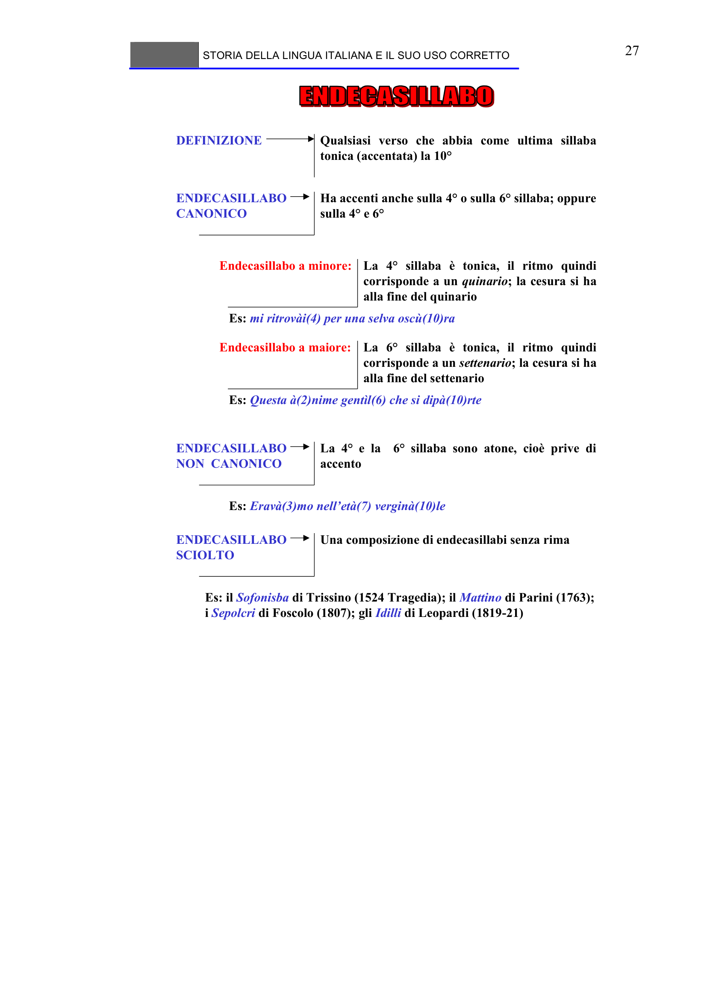

# Micro-lezione 27

## Testo originale

 
STORIA DELLA LINGUA ITALIANA E IL SUO USO CORRETTO 
 
27 
DEFINIZIONE
Qualsiasi verso che abbia come ultima sillaba 
tonica (accentata) la 10°
ENDECASILLABO 
CANONICO
Ha accenti anche sulla 4° o sulla 6° sillaba; oppure 
sulla 4° e 6°
Endecasillabo a minore: La 4° sillaba è tonica, il ritmo quindi 
corrisponde a un quinario; la cesura si ha 
alla fine del quinario
Es: mi ritrovài(4) per una selva oscù(10)ra
Endecasillabo a maiore: La 6° sillaba è tonica, il ritmo quindi 
corrisponde a un settenario; la cesura si ha 
alla fine del settenario
Es: Questa à(2)nime gentìl(6) che si dipà(10)rte
ENDECASILLABO 
NON  CANONICO
La 4° e la  6° sillaba sono atone, cioè prive di 
accento
Es: Eravà(3)mo nell’età(7) verginà(10)le
ENDECASILLABO 
SCIOLTO
Una composizione di endecasillabi senza rima
Es: il Sofonisba di Trissino (1524 Tragedia); il Mattino di Parini (1763); 
i Sepolcri di Foscolo (1807); gli Idilli di Leopardi (1819-21)
 
