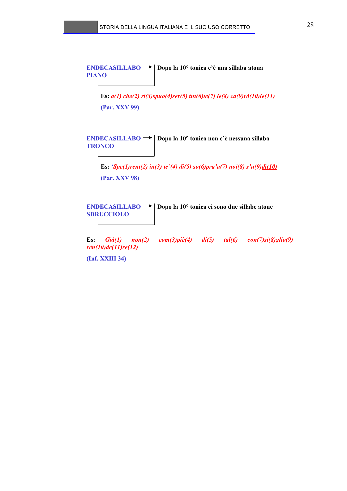

# Micro-lezione 28

## Testo originale

 
STORIA DELLA LINGUA ITALIANA E IL SUO USO CORRETTO 
 
28 
 
 
ENDECASILLABO 
PIANO
Dopo la 10° tonica c’è una sillaba atona
ENDECASILLABO 
TRONCO
Dopo la 10° tonica non c’è nessuna sillaba
ENDECASILLABO 
SDRUCCIOLO
Dopo la 10° tonica ci sono due sillabe atone
Es: ‘Spe(1)rent(2) in(3) te’(4) di(5) so(6)pra’a(7) noi(8) s’u(9)dì(10)
(Par. XXV 98)
Es: a(1) che(2) ri(3)spuo(4)ser(5) tut(6)te(7) le(8) ca(9)rò(10)le(11)
(Par. XXV 99)
Es: 
Già(1) 
non(2) 
com(3)piè(4) 
di(5) 
tal(6) 
con(7)si(8)glio(9) 
rèn(10)de(11)re(12)
(Inf. XXIII 34)
 
