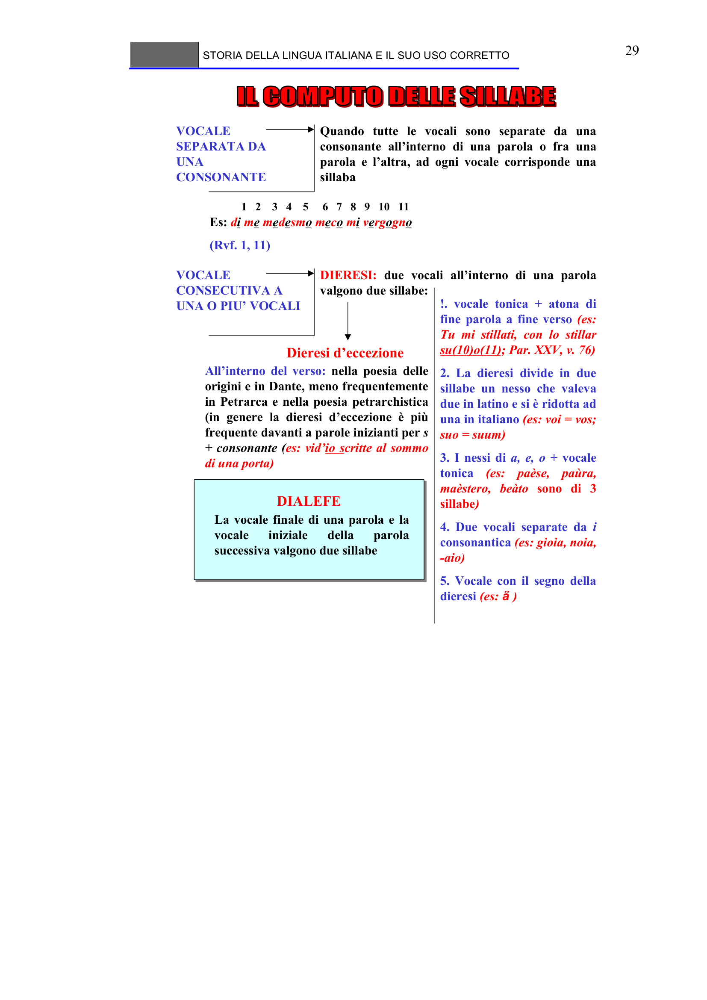

# Micro-lezione 29

## Testo originale

 
STORIA DELLA LINGUA ITALIANA E IL SUO USO CORRETTO 
 
29 
VOCALE 
SEPARATA DA 
UNA 
CONSONANTE
Quando tutte le vocali sono separate da una 
consonante all’interno di una parola o fra una 
parola e l’altra, ad ogni vocale corrisponde una 
sillaba
Es: di me medesmo meco mi vergogno
(Rvf. 1, 11)
VOCALE 
CONSECUTIVA A 
UNA O PIU’ VOCALI
DIERESI: due vocali all’interno di una parola 
valgono due sillabe:
!. vocale tonica + atona di 
fine parola a fine verso (es: 
Tu mi stillati, con lo stillar 
su(10)o(11); Par. XXV, v. 76)
2. La dieresi divide in due 
sillabe un nesso che valeva 
due in latino e si è ridotta ad 
una in italiano (es: voi = vos; 
suo = suum)
3. I nessi di a, e, o + vocale 
tonica (es: paèse, paùra, 
maèstero, beàto sono di 3 
sillabe)
4. Due vocali separate da i
consonantica (es: gioia, noia, 
-aio)
5. Vocale con il segno della 
dieresi (es: ä )
Dieresi d’eccezione
All’interno del verso: nella poesia delle 
origini e in Dante, meno frequentemente 
in Petrarca e nella poesia petrarchistica 
(in genere la dieresi d’eccezione è più 
frequente davanti a parole inizianti per s 
+ consonante (es: vid’io scritte al sommo 
di una porta)
1   2    3   4    5     6   7   8   9   10   11
DIALEFE
La vocale finale di una parola e la 
vocale 
iniziale 
della 
parola 
successiva valgono due sillabe
 
