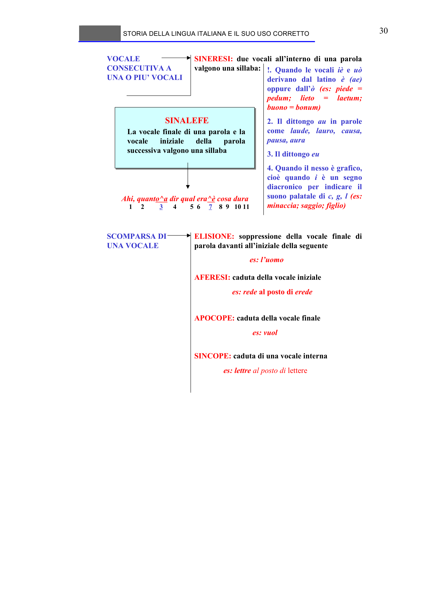

# Micro-lezione 30

## Testo originale

 
STORIA DELLA LINGUA ITALIANA E IL SUO USO CORRETTO 
 
30 
VOCALE 
CONSECUTIVA A 
UNA O PIU’ VOCALI
SINERESI: due vocali all’interno di una parola 
valgono una sillaba:
!. Quando le vocali iè e uò
derivano dal latino è (ae) 
oppure dall’ò (es: piede = 
pedum; 
lieto 
= 
laetum; 
buono = bonum)
2. Il dittongo au in parole 
come laude, lauro, causa, 
pausa, aura
3. Il dittongo eu
4. Quando il nesso è grafico, 
cioè quando i è un segno 
diacronico per indicare il 
suono palatale di c, g, l (es: 
minaccia; saggio; figlio)
SINALEFE
La vocale finale di una parola e la 
vocale 
iniziale 
della 
parola 
successiva valgono una sillaba
Ahi, quanto^a dir qual era^è cosa dura
1     2         3
4        5  6     7
8  9   10 11
SCOMPARSA DI 
UNA VOCALE
ELISIONE: soppressione della vocale finale di 
parola davanti all’iniziale della seguente
es: l’uomo
AFERESI: caduta della vocale iniziale
es: rede al posto di erede
APOCOPE: caduta della vocale finale
es: vuol
SINCOPE: caduta di una vocale interna
es: lettre al posto di lettere
 
