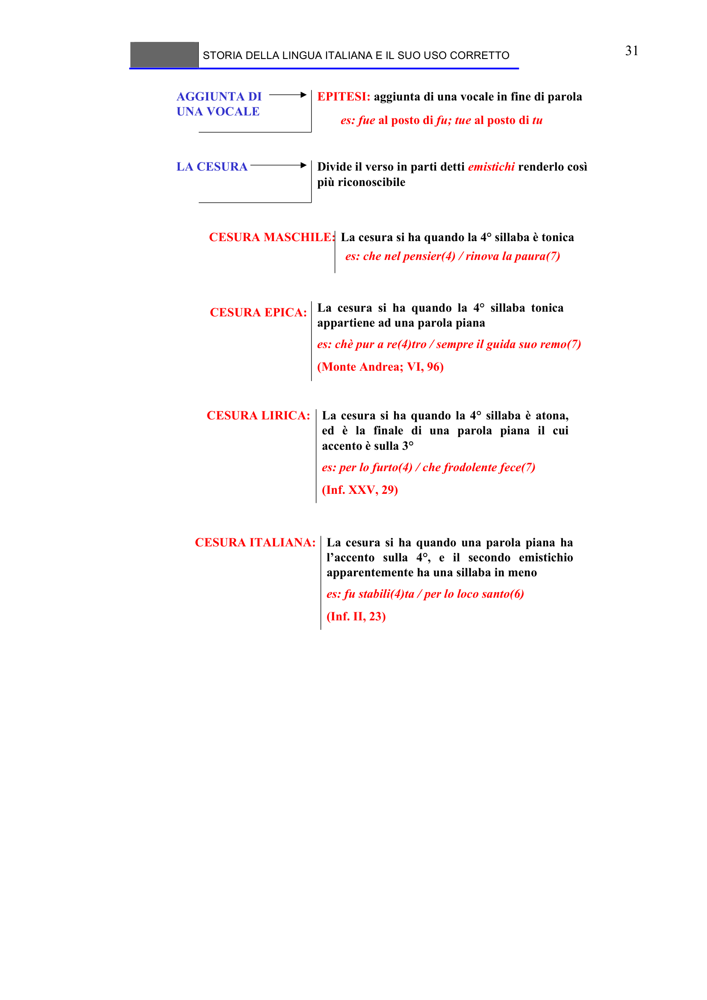

# Micro-lezione 31

## Testo originale

 
STORIA DELLA LINGUA ITALIANA E IL SUO USO CORRETTO 
 
31 
AGGIUNTA DI 
UNA VOCALE
EPITESI: aggiunta di una vocale in fine di parola
es: fue al posto di fu; tue al posto di tu
LA CESURA
Divide il verso in parti detti emistichi renderlo così 
più riconoscibile
CESURA MASCHILE:
CESURA ITALIANA: 
CESURA LIRICA:
CESURA EPICA: 
La cesura si ha quando la 4° sillaba è tonica
es: che nel pensier(4) / rinova la paura(7)
La cesura si ha quando la 4° sillaba tonica 
appartiene ad una parola piana
es: chè pur a re(4)tro / sempre il guida suo remo(7)
(Monte Andrea; VI, 96)
La cesura si ha quando la 4° sillaba è atona, 
ed è la finale di una parola piana il cui 
accento è sulla 3°
es: per lo furto(4) / che frodolente fece(7)
(Inf. XXV, 29)
La cesura si ha quando una parola piana ha 
l’accento sulla 4°, e il secondo emistichio 
apparentemente ha una sillaba in meno
es: fu stabili(4)ta / per lo loco santo(6)
(Inf. II, 23)
 
